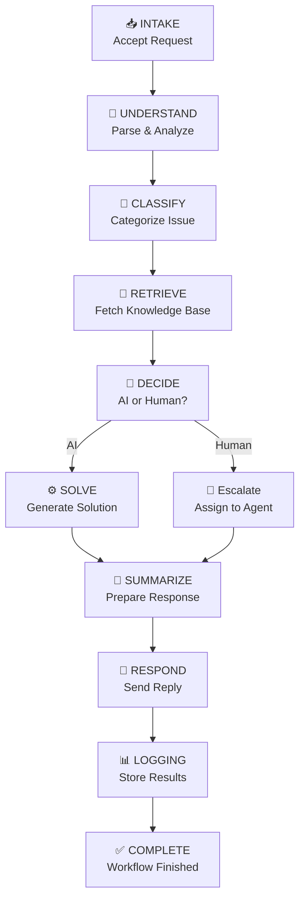

# 🚀 LangGraph Customer Support Agent  

> An **AI-powered Customer Support Agent** built with **LangGraph**.  
Implements an **11-stage workflow** with state persistence, MCP server routing, and intelligent escalation handling.  

---

## ✨ Highlights
- 🔄 11-stage structured workflow  
- 📡 Smart MCP server routing  
- 🧠 AI vs Human escalation logic  
- 📊 Full debugging & logging support  
- 🧪 Customizable test scenarios  

---

## 🔄 Workflow Overview  

The LangGraph Customer Support Agent follows an **11-stage workflow**:  



langgraph-customer-support/
│── full_langgraph_agent.py # Main agent with 11-stage workflow
│── beginner_test.py # Test scenarios for customer queries
│── config.json # Configuration for servers & stages
│── requirements.txt # Project dependencies
│── README.md # Documentation
│── .vscode/ # Debugging & launch configs


---

## ⚙️ Installation

### 1. Clone Repository
```bash
git clone https://github.com/ROCKYBH7/langgraph-customer-support.git
cd langgraph-customer-support
```

### 2. Create Virtual Environment
```bash 
python -m venv venv
# Windows
venv\Scripts\activate
# Mac/Linux
source venv/bin/activate
```

### 3. Install Dependencies
```bash
pip install -r requirements.txt
```

## ▶️ Running the Agent

Run the test scenarios:
```bash

python beginner_test.py
```

Expected logs:

```pgsql
INFO - 📥 Accept customer request - INTAKE
INFO - ✅ INTAKE completed
INFO - 🧠 Parse and understand request - UNDERSTAND
INFO - ✅ Workflow completed successfully
```

## 🧪 Custom Tests

You can add your own test cases inside beginner_test.py:
```python
{
    "name": "Custom Test",
    "customer": {
        "customer_name": "Test User",
        "email": "test@example.com",
        "query": "I cannot log into my account",
        "priority": "HIGH",  # LOW | MEDIUM | HIGH | URGENT
        "ticket_id": "TKT-1234"
    }
}
```

## 📊 Debugging

  - Set breakpoints in VSCode (full_langgraph_agent.py)

  - Use F5 to start debugging

  - Track variables in the Debugger panel

  - Logs will show ✅ stage completions, 📡 server routing, and 🚨 escalations


## 👨‍💻 Author

Balaji R H

📍 Madurai, India

💼 **Data Scientist | AI/ML Engineer | Python & SQL Specialist | SDET Trainee | Cloud (Beginner)**  


🔗 [LinkedIn](https://www.linkedin.com/in/balaji-r-h-a81107298)

🔗 [GitHub](https://github.com/ROCKYBH7)
